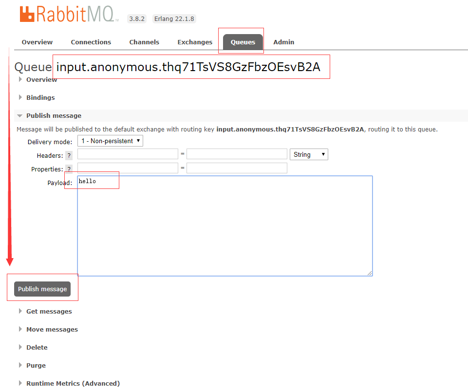
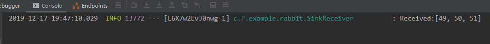

# helloword

## 使用 docker 启动 rabbitmq

这里注意获取镜像的时候要获取management版本的，不要获取last版本的，management版本的才带有管理界面。

### 启动 rabbitmq

```sh
docker pull docker.io/rabbitmq:3.8-management
docker run --name rabbitmq -d -p 15672:15672 -p 5672:5672 rabbitmq:3.8-management
```

- `--name` 指定了容器名称
- `-d` 指定容器以后台守护进程方式运行
- `-p` 指定容器内部端口号与宿主机之间的映射，rabbitMq默认要使用15672为其web端界面访问时端口，5672为数据通信端口

### rabbitmq 用户角色权限操作

默认的guest 账户有访问限制，默认只能通过本地网络(如 localhost) 访问，远程网络访问受限，所以在使用时我们一般另外添加用户，例如我们添加一个root用户：

```sh
# 1. 进入容器
docker exec -it rabbitmq bash
# 2. 添加 root 用户
rabbitmqctl add_user root 123456
# 3. 赋予 root 用户所有权限
rabbitmqctl set_permissions -p / root ".*" ".*" ".*"
# 4. 赋予 root 用户 adminstrator 角色
rabbitmqctl set_user_tags root administrator
# 5. 查看所有用户
rabbitmqctl list_users
```

退出容器访问 rabbitmq web 管理界面，使用新创建的 root 用户登录。

## 初次使用 spring-cloud-starter-stream-rabbit

### maven 依赖

```xml
<?xml version="1.0" encoding="UTF-8"?>
<project xmlns="http://maven.apache.org/POM/4.0.0" xmlns:xsi="http://www.w3.org/2001/XMLSchema-instance"
         xsi:schemaLocation="http://maven.apache.org/POM/4.0.0 https://maven.apache.org/xsd/maven-4.0.0.xsd">
    <modelVersion>4.0.0</modelVersion>
    <parent>
        <groupId>org.springframework.boot</groupId>
        <artifactId>spring-boot-starter-parent</artifactId>
        <version>1.5.22.RELEASE</version>
        <relativePath/> <!-- lookup parent from repository -->
    </parent>
    <groupId>example</groupId>
    <artifactId>spring-cloud-stream-com.fengxuechao.example.rabbit-example</artifactId>
    <version>0.0.1-SNAPSHOT</version>
    <name>spring-cloud-stream-com.fengxuechao.example.rabbit-example</name>
    <description>Demo project for Spring Boot</description>

    <properties>
        <java.version>1.8</java.version>
        <spring-cloud.version>Edgware.SR6</spring-cloud.version>
    </properties>

    <dependencies>
        <dependency>
            <groupId>org.springframework.boot</groupId>
            <artifactId>spring-boot-starter-web</artifactId>
        </dependency>
        <dependency>
            <groupId>org.springframework.cloud</groupId>
            <artifactId>spring-cloud-starter-stream-com.fengxuechao.example.rabbit</artifactId>
        </dependency>
        <dependency>
            <groupId>org.projectlombok</groupId>
            <artifactId>lombok</artifactId>
            <optional>true</optional>
        </dependency>
    </dependencies>

    <dependencyManagement>
        <dependencies>
            <dependency>
                <groupId>org.springframework.cloud</groupId>
                <artifactId>spring-cloud-dependencies</artifactId>
                <version>${spring-cloud.version}</version>
                <type>pom</type>
                <scope>import</scope>
            </dependency>
        </dependencies>
    </dependencyManagement>

    <build>
        <plugins>
            <plugin>
                <groupId>org.springframework.boot</groupId>
                <artifactId>spring-boot-maven-plugin</artifactId>
            </plugin>
        </plugins>
    </build>

</project>
```

### 创建接收器

```java
package example.com.fengxuechao.example.rabbit;

import lombok.extern.slf4j.Slf4j;
import org.springframework.cloud.stream.annotation.EnableBinding;
import org.springframework.cloud.stream.annotation.StreamListener;
import org.springframework.cloud.stream.messaging.Sink;

/**
 * {@link EnableBinding} 注解实现对消息通道的绑定<br>
 * {@link Sink} 是 Spring Cloud Stream 中默认实现的对输入消息通道的绑定的定义<br>
 * {@link StreamListener} 该注解表示该方法为消息中间件上数据流的事件监听器,
 * Sink.INPUT参数表示这是input消息通道上的监听处理器
 *
 * @author fengxuechao
 * @version 0.1
 * @date 2019/12/6
 */
@Slf4j
@EnableBinding(Sink.class)
public class SinkReceiver {

    @StreamListener(Sink.INPUT)
    public void receive(Object payload) {
        log.info("Received:{}", payload);
    }
}
```

### 发送消息

在 rabbitmq 管理网页使用 guest 账号登录,



**结果**



消息是收到了，但结果好像不一样，这是因为消息没有序列化。

### 创建消息生产者

但我们如何生产消息呢？

为了偷懒，我就在一个类中创建了一个定时器用来发送消息

```java
@Slf4j
@EnableBinding({Sink.class, Source.class})
public class SinkReceiver {

    @Autowired
    private Source source;

    /**
     * 要指定输出通道
     */
    @Autowired
    @Qualifier("output")
    private MessageChannel messageChannel;

    /**
     * 消费消息
     *
     * @param payload
     */
    @StreamListener(Sink.INPUT)
    public void receive(@Payload String payload) {
        log.info("Received:{}", payload);
    }

    /**
     * 支持企业消息集成
     * 处理消息
     *
     * @param message
     * @return
     */
    @Transformer(inputChannel = Sink.INPUT, outputChannel = Source.OUTPUT)
    public Object transform(String message) {
        return message.toUpperCase();
    }

    /**
     * 生产消息
     */
    @Scheduled(fixedRate = 2000)
    public void sendMessage() {
        log.info("定时发送消息");
        // 使用 Source 和 MessageChannel 可以达到同样的效果
        source.output().send(MessageBuilder.withPayload("hello, 123").build());
//        messageChannel.send(MessageBuilder.withPayload("hello, 123").build());
    }
}
```

**注意**：`@Transformer` 注解，简单提一句 `spring-cloud-stream` 建立在 Enterprise Integration Patterns 定义的概念和基础，框架是 `Spring Integration`

别急，还有关键配置没有配置

application.yml

```yaml
server:
  port: 8080
spring:
  application:
    name: example-rabbit-hello
  rabbitmq:
    addresses: 192.168.200.19:5672
  cloud:
    stream:
      bindings:
        output:
          destination: input
```

如此，简单的使用 `spring-cloud-stream` 也就入了门。


